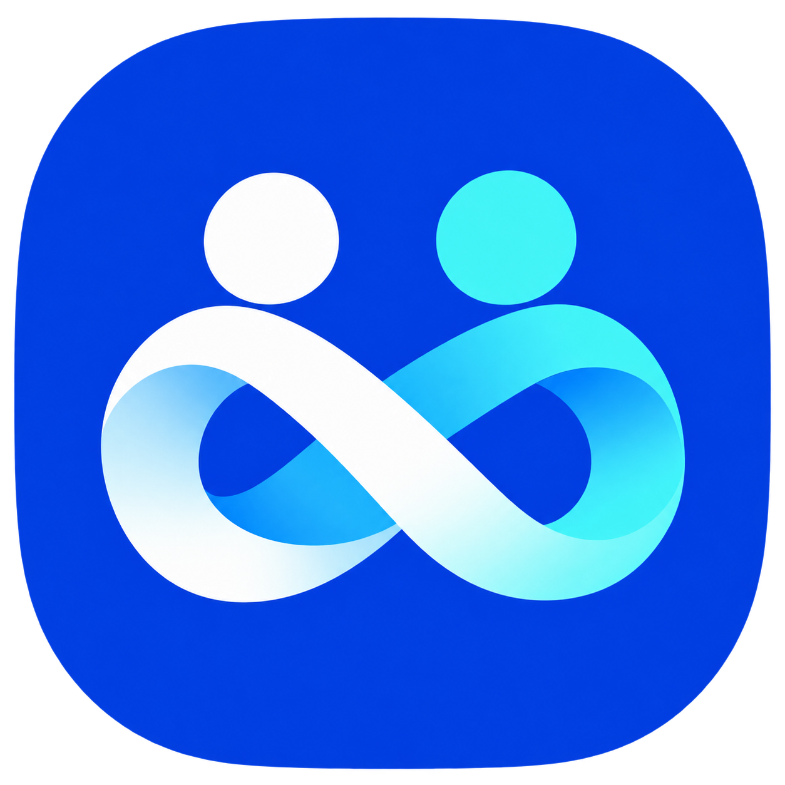
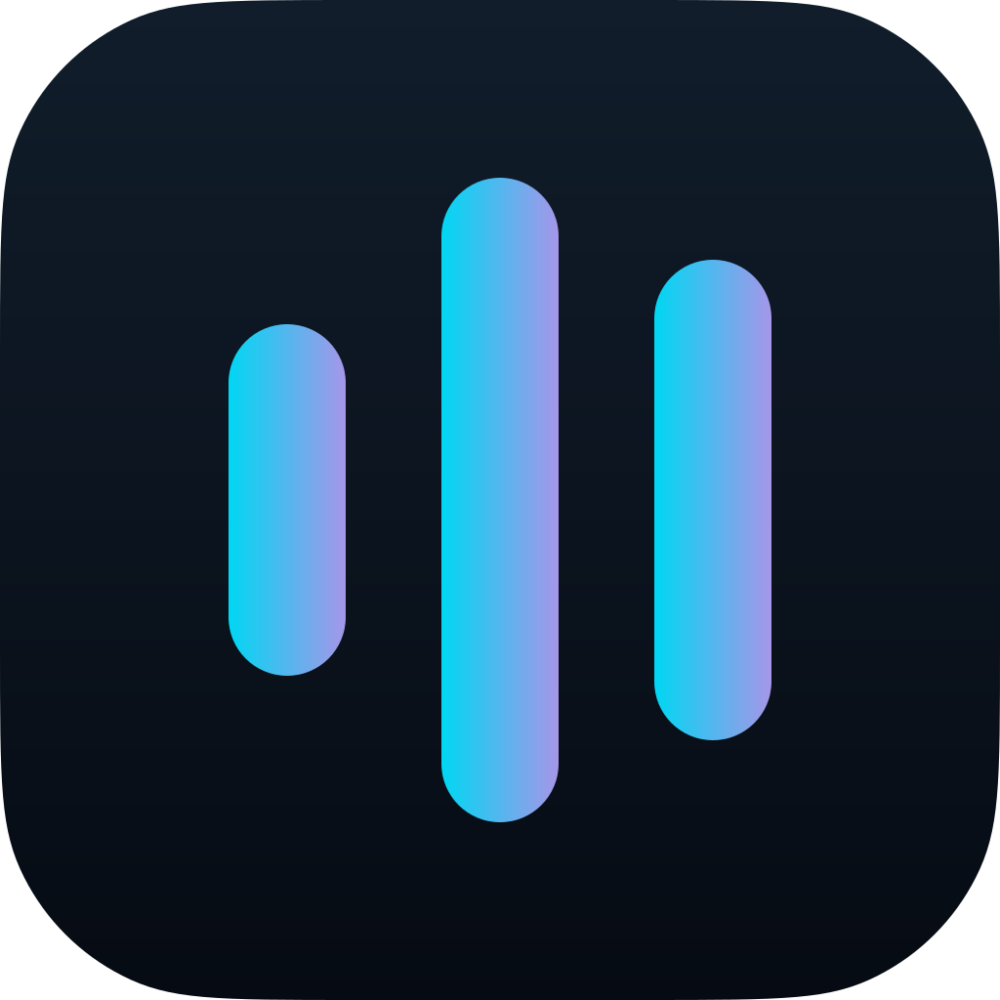

#  일상과 현장의 불편을 해결하는 AI 서비스

사람의 행동을 이해하는 **개인 에이전트**와 방문객·운영자를 연결하는 **지역축제 플랫폼**을 만듭니다.

사용자가 AI를 직접 통제하고, 누구나 쉽게 이용하며, 실제 현장에서 안정적으로 운영할 수 있는 서비스를 지향합니다.

## 프로젝트

###  [FESTAI](https://github.com/est-34/fest-ai)

**방문객 안내부터 현장 운영, ESG 성과 관리까지 연결하는 지역축제 플랫폼**

| 사용자 | 주요 기능 |
| --- | --- |
| 방문객 | QR로 접속하는 모바일 웹 · AI·음성 안내 · 예약·대기표 · 쿠폰·리워드 · 4개 언어 지원 |
| 운영자 | 콘텐츠 검수 · 혼잡·민원·사고 대응 · ESG 실적 및 보고서 관리 |
| 참여업체 | 전용 콘솔에서 부스·메뉴·쿠폰 관리 |

**기술 스택** · TypeScript · Next.js · React · Python · FastAPI · PostgreSQL

###  [SilentOrchestra 2.0](https://github.com/est-34/wave-on)

**반복되는 몸짓과 행동을 학습해, 사용자가 승인한 동작을 실행하는 개인 에이전트**

- **학습과 제안** — 활동별로 몸짓과 후속 행동을 학습하고, 실행할 동작을 제안합니다.
- **사용자 승인** — 승인한 연결만 실행하고, 재인식 피드백으로 연결을 조정합니다.
- **로컬 우선 실행** — 기본 모드는 실제 동작을 수행하지 않는 `DRY_RUN`입니다. 카메라 인식과 OS 제어는 선택적으로 연결합니다.

**기술 스택** · Python · FastAPI · SQLAlchemy · SQLite / PostgreSQL · JavaScript

## 팀원 소개

기획부터 프론트엔드·백엔드 개발, 배포까지 함께 만드는 팀입니다.

| [강덕현](https://github.com/duckduck-e) | [김나영](https://github.com/nadanaya) | [서하니](https://github.com/gksl3690) | [심주혜](https://github.com/juuhye) | [정상겸](https://github.com/ken-jeong) |
| :---: | :---: | :---: | :---: | :---: |
|  |  |  |  |  |

## 우리가 중요하게 생각하는 것

- **사용자 통제** — 자동 실행과 정보 공개는 승인 절차를 거쳐 사용자가 판단하도록 합니다.
- **쉬운 접근** — 몸짓·음성·다국어 등 다양한 이용 방식을 고려합니다.
- **안정적인 운영** — 서비스 목적에 맞게 로컬 우선 처리와 외부 AI 장애 시 대체 동작을 적용합니다.
- **확인 가능한 근거** — 사용자 피드백, 콘텐츠 승인 여부, 실적의 출처와 감사 기록을 중요하게 다룹니다.

각 프로젝트의 자세한 소개와 실행 방법은 [FESTAI](https://github.com/est-34/fest-ai#readme)와 [SilentOrchestra 2.0](https://github.com/est-34/wave-on#readme) 저장소에서 확인할 수 있습니다.
